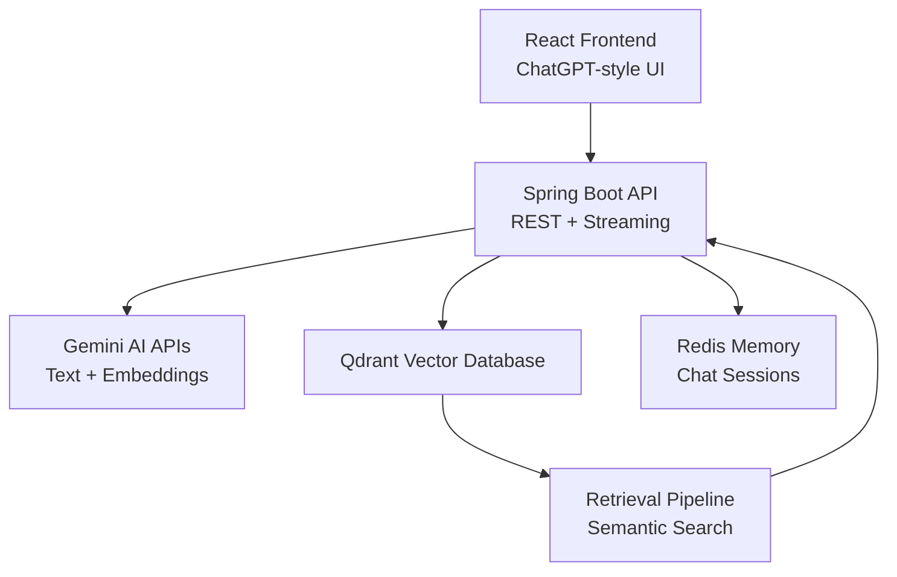

# Enterprise RAG AI Assistant

Production-Grade Retrieval-Augmented Generation (RAG) Platform built using Spring Boot, Gemini AI, Qdrant, Redis, Docker, and React.

# Project Overview
This project is a fully functional enterprise-style AI assistant platform capable of:

* Semantic Search
* Retrieval-Augmented Generation (RAG)
* Conversational Memory
* Streaming AI Responses
* PDF/TXT Knowledge Ingestion
* Vector Similarity Search
* Metadata-Aware Retrieval
* Grounded AI Responses
* Real-Time Chat UI

The system combines modern AI infrastructure with scalable backend engineering patterns.

# Core Features

## AI & RAG

* Gemini-powered text generation
* Gemini embedding generation
* Grounded Retrieval-Augmented Generation
* Semantic vector search
* Source-aware retrieval
* Streaming AI responses
* Conversational memory using Redis

## Vector Database

* Qdrant vector database integration
* Embedding storage
* Similarity search
* Metadata payload support
* Chunk-based retrieval

## File Ingestion Pipeline

Supports:

* TXT uploads
* PDF uploads
* Automatic chunking
* Embedding generation
* Vector indexing

## Frontend Features

* ChatGPT-style UI
* Real-time response streaming
* File upload support
* Conversational interface
* Modern responsive dark theme

# System Architecture


#  End-to-End RAG Flow
```text
User Question
      ↓
Generate Embedding
      ↓
Qdrant Semantic Search
      ↓
Retrieve Relevant Chunks
      ↓
Inject Context into Prompt
      ↓
Gemini Generates Grounded Answer
      ↓
Streaming Response to Frontend

```

# Project Structure

```text
rag-service/
│
├── backend/
│   ├── controller/
│   ├── service/
│   ├── ai/
│   ├── qdrant/
│   ├── config/
│   ├── model/
│   └── ratelimit/
│
├── rag-ui/
│   ├── src/
│   ├── components/
│   └── api/
│
└── docker/
```

# Backend Tech Stack

| Technology     | Purpose               |
| -------------- | --------------------- |
| Java 21        | Backend Runtime       |
| Spring Boot    | REST APIs             |
| Spring WebFlux | Streaming Responses   |
| Gemini AI      | LLM + Embeddings      |
| Qdrant         | Vector Database       |
| Redis          | Conversational Memory |
| Redisson       | Redis Client          |
| Docker         | Containerization      |
| Maven          | Dependency Management |

# Frontend Tech Stack

| Technology   | Purpose             |
| ------------ | ------------------- |
| React        | Frontend UI         |
| Vite         | Frontend Build Tool |
| Tailwind CSS | Modern Styling      |
| Axios        | API Communication   |

# Supported Document Types
  TXT, PDF, Images, OCR, DOCX

# Core Components

## Embedding Service

Generates semantic embeddings using Gemini.

## Qdrant Service
Stores:
* vectors
* metadata
* chunk references
* semantic payloads

##  Chat Memory Service
Maintains:
* multi-turn conversations
* Redis-based memory
* session-aware context
  
## Chunking Service
Splits large documents into overlapping chunks for better retrieval quality.

# Advanced Features Implemented

## Semantic Search
Searches by meaning instead of exact keyword matching.

## Streaming Responses
ChatGPT-style token streaming implemented using:
* Spring WebFlux
* Flux
* Server Sent Events (SSE)

## Metadata-Aware Retrieval
Each vector stores:
{
  "text": "...",
  "source": "document.pdf",
  "chunk": 4
}

## Conversational Memory
Conversation history persisted in Redis for contextual follow-up questions.

# API Endpoints

## Upload TXT
POST /api/upload/txt

## Upload PDF
POST /api/upload/pdf
## Semantic RAG Query
GET /api/ai/rag?question=...

## Streaming RAG Query
GET /api/ai/rag-stream?question=...

## Conversational Memory Query
GET /api/ai/rag-memory?chatId=123&question=...

# Demo Screenshots

## Chat UI


---

## 🔹 Streaming Responses

> Add screenshot here

```text
README/images/streaming.png
```

---

## 🔹 PDF Upload & Retrieval

> Add screenshot here

```text
README/images/pdf-upload.png
```

---

## 🔹 Qdrant Vector Payloads

> Add screenshot here

```text
README/images/qdrant-payloads.png
```

---

# Upcoming Enhancements
* Hybrid Search
* OCR Support
* Multimodal RAG
* Persistent Chat Sessions
* User Authentication
* Kubernetes Deployment
* AI Agents / Tool Calling
* Observability & Monitoring

# Key Engineering Concepts Demonstrated

* Retrieval-Augmented Generation
* Semantic Vector Search
* Prompt Grounding
* Streaming AI Architectures
* Conversational Memory
* Distributed Caching
* AI Backend Engineering
* Enterprise RAG Design
* Vector Database Integration
* Multimodal AI Foundations
* Docker Compose Deployment

# Why This Project Stands Out
This project demonstrates:
* Real-world AI system architecture
* Full-stack AI engineering
* Production-grade backend design
* Scalable retrieval pipelines
* Modern AI infrastructure patterns
* End-to-end RAG implementation

Unlike tutorial-only projects, this system includes:
* conversational memory
* streaming responses
* vector retrieval
* metadata-aware search
* PDF ingestion
* frontend integration
* real AI infrastructure
* Docker Compose Deployment

# Rag-Service
SharePoint-based RAG + LLM platform

Phase 1 - Foundation
Building of automated SharePoint ingestion pipeline in Java/Spring Boot using Microsoft Graph API, Apache Tika for multi-format parsing, and Qdrant vector DB - processing 5,000+ document chunks with idempotent incremental sync.

Phase 2 - RAG query engine + API
Engineered RAG query engine with Spring AI - embedding user queries, semantic retrieval from vector store, prompt construction, and streaming LLM responses via SSE. Implemented Redis sliding-window rate limiting using Redisson to protect the API under load.

Phase 3 - Kubernetes + CI/CD
Containerised and deployed the platform on Kubernetes (minikube/GKE) with Helm charts - including HPA autoscaling, StatefulSets for Redis and Qdrant with PVCs, and a GitHub Actions CI/CD pipeline automating build-test-push-deploy on every merge to main.

Phase 4 - Polish + observability
Added production observability with Prometheus/Grafana dashboards tracking P95 RAG latency and token usage. Achieved 85% unit test coverage using JUnit 5 + Testcontainers. Validated autoscaling under load with k6 load tests.

# If You Like This Project

Give the repository a star ⭐
